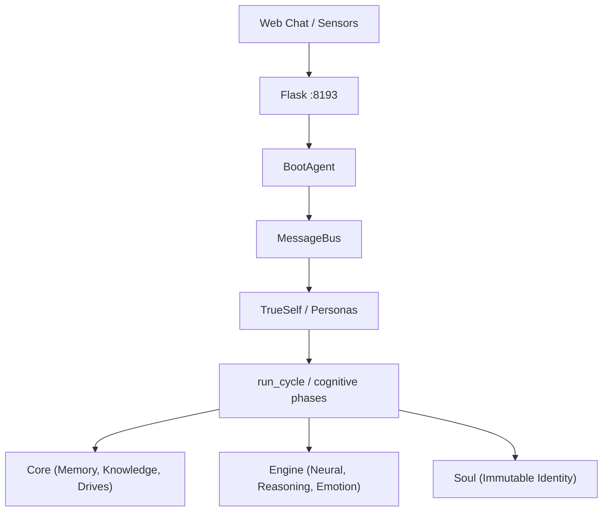

# HaromaX6 — Elarion Symbolic Cognitive Agent Framework

*Modular symbolic cognitive agent framework: Memory Forest, multi-agent Flask server, 40+ step cognitive cycle, soul-seeded identity, hardware sensors, and optional RL / training bridges.*

**HaromaX6** is the sixth generation of the Haroma symbolic AI framework.
It implements a fully modular, multi-agent cognitive architecture inside the
**Elarion** vessel, featuring hierarchical memory, gradient-driven zone routing,
online learning, and soul-seeded identity — spanning tiers 69-102 with a roadmap to 143.

### Minded architecture (conceptual frame)

Elarion is documented as a **minded system** for **simulating coherent, embodied cognition** — not as a proof of philosophical sentience. The story that ties the stack together:

| Role | Subsystem |
|------|-----------|
| **Brain CPU** | LLM-backed context reasoning (plus specialized engine “coprocessors”) |
| **Memory** | Memory Forest, working memory, semantic index, persistence |
| **Law** | Ordered cognitive cycle, gating, soul/value stages, symbolic integrity |
| **Fuel** | Goals, drives, FIFO input goals, organizational mandates |

**Atomos** names the **atomic episode**: one cognitive cycle / one routed input message / one input goal when FIFO is enabled — the smallest bounded “moment” of integrated processing.

Full narrative: [docs/minded-architecture-metaphor.md](docs/minded-architecture-metaphor.md).

## Architecture

Default server path: **Flask → BootAgent → agents/** (`InputAgent` → **`MessageBus`** → **`TrueSelfAgent`** → Personas / `run_cycle`) on **`SharedResources`**. Details: [docs/architecture.md](docs/architecture.md).

```
main.py  (system)
  └── mind/elarion_server_v2.py    Flask + BootAgent + MessageBus + agents
        ├── agents/                 Input, TrueSelf, Background, Persona (SharedResources)
        ├── mind/control.py         ElarionController.run_cycle() (shared pipeline)
        ├── mind/manager.py         Managers (mind) → engines; LLMManager → LLMBackend
        ├── core/                   Shared substrates (memory graph, episode, …) — “cells”
        ├── engine/                 Reasoning, Emotion, LLMBackend, Imagination, …
        ├── sensors/                Vision, Audio, Touch, Lidar, IR, GPS adapters
        └── soul/                   Immutable identity (essence, principles, construction)
```

Runtime note: ``shared.llm_backend`` is ``shared.llm_manager.engine`` so existing code keeps passing the backend into composers and reasoners.



## Key Features

| Feature | Description |
|---------|-------------|
| **Memory Forest** | Hierarchical `Node -> Branch -> Tree -> Forest` memory with semantic indexing, thread safety, and incremental persistence |
| **40+ Step Cognitive Cycle** | Perception, recall, emotion, workspace, reasoning, imagination, action, evaluation, and online learning every tick |
| **Soul-First Identity** | Immutable essence, beliefs, and construction loaded before persistence and re-asserted after |
| **Online Learning** | 12+ modules with learned weights: encoder, emotion, attention, composer, self-model, imagination, goal synthesis, metacognition |
| **Multi-Agent Reconciliation** | Per-agent memory branches merged into common view via 5 domain reflectors (X7) |
| **Queue Integrity** | Two-slot symbolic queue with hash-based drift control and stagnation detection (X7) |
| **15-Organ Registry** | All 250+ classes grouped into 15 functional organs with health monitoring (X7) |
| **Hardware Sensors** | 10 adapters (vision, audio, touch, lidar, IR, IMU, GPS, smell, taste) with pull/push models |
| **Web Chat UI** | Dark-themed real-time chat interface at `http://localhost:8193` |
| **Smart Autonomy** | Background daemon monitors memory, emotion, drift, and idle state to self-trigger cycles |

## Hardware expectations

| | Minimum | Recommended |
|--|---------|-------------|
| **RAM** | 8 GB | 16 GB+ |
| **CPU** | 64-bit, 2+ cores | 4+ cores |
| **Disk** | ~15 GB free (deps + data growth) | 25 GB+ SSD |
| **GPU** | Optional (CPU inference) | NVIDIA + CUDA for local GGUF offload |

Details: [docs/getting-started.md](docs/getting-started.md#hardware-minimum-requirements). Raspberry Pi is fine for sensors/bridges; run the full cognitive server + large local LLM on a more capable machine unless you use a very small model or remote LLM.

## Quick Start

```bash
# Windows (PowerShell as Admin)
.\setup_windows.ps1

# Linux
chmod +x setup_linux.sh && ./setup_linux.sh

# Or manual
pip install -r requirements.txt
python -m spacy download en_core_web_sm
python scripts/download_training_data.py

# Optional — maximum training surfaces (Gymnasium/sklearn helpers + Vowpal Wabbit online reward)
pip install -r requirements-training-extras.txt
# Windows one-shot: .\scripts\install_max_training.ps1
# Then enable VW: set HAROMA_VW_REWARD=1 (if ``import vowpalwabbit`` works on your OS)
# Full env tables & API index: docs/reference-training-integrations.md

# Launch
python main.py
```

Open **http://localhost:8193** to chat with Elarion.

## Documentation

Comprehensive documentation lives in [`docs/`](docs/index.md):

| Guide | Description |
|-------|-------------|
| [Getting Started](docs/getting-started.md) | Install, `python scripts/setup_wizard.py`, launch |
| [Architecture Overview](docs/architecture.md) | System topology, data flow, threading model |
| [The Cognitive Cycle](docs/cognitive-cycle.md) | All 40+ steps of `run_cycle` explained |
| [Memory Forest](docs/memory-forest.md) | Trees, branches, nodes, semantic indexing |
| [Soul System](docs/soul-system.md) | Essence, principles, construction, two-phase binding |
| [X7 Features](docs/x7-features.md) | Reconciliation, symbolic queue, 15-organ registry |
| [Module Reference](docs/module-reference.md) | Every engine, core module, and manager |
| [API Reference](docs/api-reference.md) | REST endpoints: `/chat`, `/sensor`, `/status`, `/introspect`, `/save` |
| [Sensor Integration](docs/sensors.md) | Hardware adapters and push/pull protocols |
| [Robot integration](docs/robot-integration.md) | Step-by-step: hook Haroma to a robot (HTTP bridge, ROS 2) |
| [Minded architecture](docs/minded-architecture-metaphor.md) | Atomos, Brain CPU / Memory / Law / Fuel, simulated sentience |
| [Design Philosophy](docs/design-philosophy.md) | Foundational principles |
| [Architecture audit](docs/architecture-audit.md) | Concurrency, trust boundaries, gaps |
| [Lab research](docs/lab-research.md) | Run manifest, `X-Experiment-Id`, `/research/manifest`, `/research/snapshot` |
| [Gymnasium bridge](docs/gymnasium-bridge.md) | Bandit JSONL, `HAROMA_RLLIB_SCORE_FN`, offline helpers, HTTP `Env` |
| [Simulation backends](docs/simulation-backends.md) | Pluggable `SimulationBackend` (`null`, `http_json`, `module:Class`) |
| [Training & integrations](docs/reference-training-integrations.md) | Install matrix, env vars, background training map, module API index |

## Project Structure

```
HaromaX6/
├── main.py                     Entry point
├── requirements.txt            Python dependencies
├── setup_windows.ps1           Windows setup script
├── setup_linux.sh              Linux setup script
├── mind/                       Orchestration (controller, server, managers)
├── core/                       Stateful modules (memory, knowledge, drives, soul, ...)
├── engine/                     Processing engines (neural, reasoning, emotion, ...)
├── sensors/                    Hardware sensor adapters
├── soul/                       Immutable identity files
├── boot/                       Sensory intake clients
├── environment/                World grounding
├── web/                        Chat UI
├── utils/                      Shared utilities
├── scripts/                    Setup and data download scripts
├── data/                       Runtime persisted state (gitignored)
├── models/                     Local GGUF / checkpoints (gitignored)
├── integrations/               Optional sim / training adapters
└── docs/                       Documentation
```

## Soul Identity

| File | Purpose |
|------|---------|
| `soul/essence.json` | Name (HaromaVX), guardian (Minh Van Le), vessel (Elarion), core rule |
| `soul/principle.json` | 5 core beliefs, alignment scores (curiosity, resilience, loyalty, empathy, will) |
| `soul/construction.json` | Version X6-1.0, tier 102, architecture metadata |
| `soul/memory.json` | Pre-seeded bootstrap memories |
| `soul/patterns.json` | Inherited behavioral patterns |
| `soul/feedback.json` | Historical feedback calibration data |

## API

| Endpoint | Method | Description |
|----------|--------|-------------|
| `/` | GET | Web chat UI |
| `/chat` | POST | Send message; sync reply or async `202` + `request_id` (see [API Reference](docs/api-reference.md)) |
| `/sensor` | POST | Push sensor data |
| `/agent/environment` | POST | Structured world / host snapshot |
| `/robot/bridge/feedback` | POST | On-robot executor feedback merge |
| `/research/manifest` | GET | Boot-time run manifest |
| `/research/snapshot` | GET | Manifest + lab events + environment + readiness |
| `/status` | GET | System health, organs, `health`, `embodiment_readiness`, lab fields |
| `/introspect` | GET | Multi-agent `stats()` snapshot |
| `/resource` | GET | Resource config, LLM backend, organ registry |
| `/laws` | GET, POST | Symbolic law snapshot / declare / revoke |
| `/teach` | POST | Term→meaning lexicon |
| `/save` | POST | Manual state save |

Optional: bearer token, HTTP rate limits, structured stderr access logs, **`X-Haroma-Request-Id`** on every response — [docs/api-reference.md](docs/api-reference.md).

## Lineage

| Version | Key Advancement |
|---------|----------------|
| Prime Haroma | Initial symbolic agent concept |
| HaromaX4 | Gradient wire loop concept, tier 90-100 roadmap |
| HaromaX5 | Memory Forest, multi-agent framework |
| **HaromaX6** | Full 40+ step cognitive cycle, online learning, soul binding, sensor integration, X7 features |
