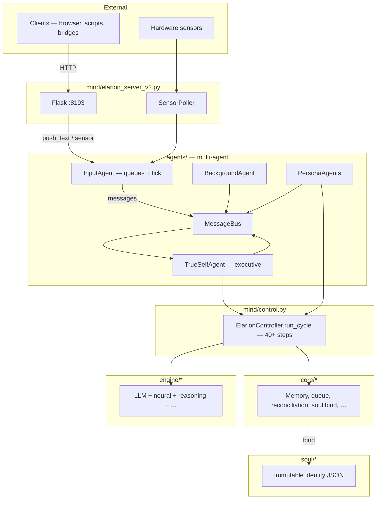
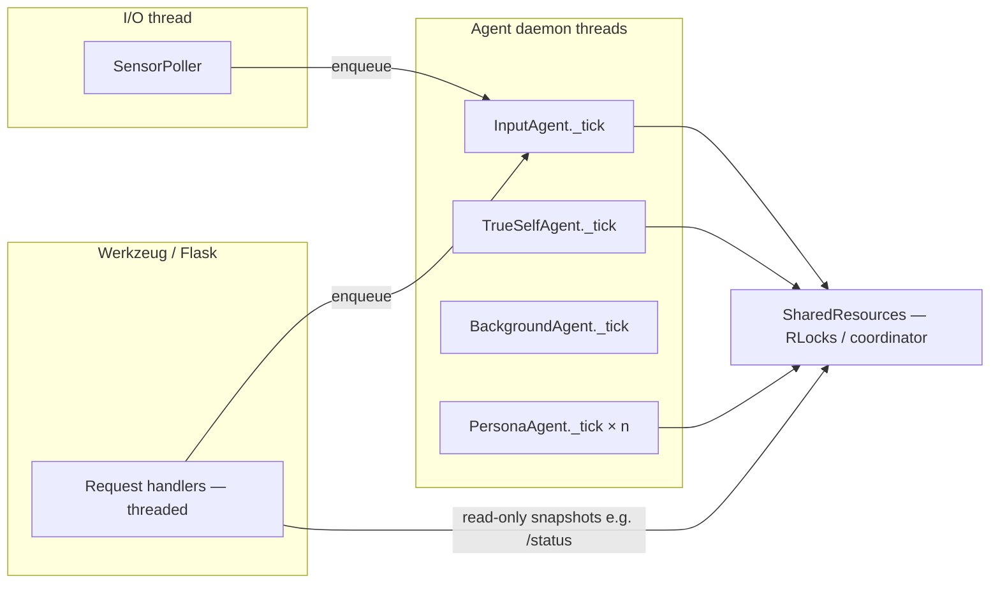

# Architecture Overview

[<- Back to Index](index.md)

HaromaX6 is a modular cognitive architecture organized into layers. Each layer has strict ownership boundaries — modules communicate through well-defined interfaces, never by reaching into each other's internals.

### Minded architecture mapping

This topology implements the **[minded architecture metaphor](minded-architecture-metaphor.md)**:

- **Brain CPU:** LLM context stack and backends in `engine/` (primary integrator); other engines are **coprocessors**.
- **Memory:** `MemoryForest`, persistence, working memory, knowledge graph in `core/`.
- **Law:** `run_cycle` / persona pipeline order, `ProcessGate`, soul binding, X7 queue integrity — **what may run and when**.
- **Fuel:** `GoalEngine`, input FIFO goals when enabled, drives, organizational goal board — **what the system is trying to do**.

**Atomos:** one full cycle for one routed message (or one input-channel message / one input goal in FIFO mode) is the intended **atomic episode** of integration.

---

## Canonical runtime shape (multi-agent v6)

This is the **default** path when you run `main.py` (Flask + `BootAgent`). It supersedes older single-loop descriptions that referred to a monolithic “LifeLoop” thread.

| Stage | Code | Role |
|-------|------|------|
| **HTTP** | `mind/elarion_server_v2.py` | Werkzeug/Flask on **:8193**; handlers push text/sensors into **InputAgent**; optional bearer, rate limit, request ids (`X-Haroma-Request-Id`). |
| **Boot** | `agents/boot_agent.py` | Builds **`SharedResources`**, **`MessageBus`**, starts **InputAgent**, **TrueSelfAgent**, **BackgroundAgent**, **PersonaAgent(s)**, **`SensorPoller`**. |
| **Ingress** | `agents/input_agent.py` | Threaded **tick** drains user/sensor queues, light NLU/embeddings, forwards to **TrueSelf** via the bus (v6: sole consumer of peripheral input). |
| **Executive** | `agents/trueself_agent.py` | Routes input, delegates to **personas**, reconciles relay/dream messages — the **TrueSelf** executive layer. |
| **Specialists** | `agents/persona_agent.py` | Persona cycles; heavy cognition runs here via **`ElarionController.run_cycle`**-style pipelines bound to episodes. |
| **Background** | `agents/background_agent.py` | Dreams, training hooks, persistence cadence — concurrent with chat, coordinated via bus + locks. |
| **Cognition core** | `mind/control.py` | **`ElarionController.run_cycle`** — ordered pipeline (perceive → recall → …); shared by personas/TrueSelf work, not a separate “life loop” thread name in `agents/`. |
| **State** | `agents/shared_resources.py` | Single façade to **core/** engines, memory, LLM backend, `agent_environment`, metrics. |

For embedding cognition **without** HTTP, you still call into **`ElarionController.run_cycle`** with a constructed controller + shared state; the multi-agent wrappers are the production server shape.

---

## System Topology



---

## Directory Layout

```
HaromaX6/
├── main.py                    Entry point — launches the server
├── requirements.txt           Python dependencies
├── setup_windows.ps1          Windows — `.venv` + `requirements.txt`
├── setup_linux.sh             Linux — dispatches to `scripts/setup_{ubuntu,fedora,arch,alpine,opensuse}.sh`
│
├── agents/                    Multi-agent control plane (default server)
│   ├── boot_agent.py          BootAgent — SharedResources, bus, agent lifecycle
│   ├── input_agent.py         Ingress queues, tick, forward to TrueSelf
│   ├── trueself_agent.py      Executive routing and delegation (v6)
│   ├── background_agent.py    Dreams, training, persistence rhythm
│   ├── persona_agent.py       Specialist personas + cognitive cycle work
│   ├── message_bus.py         Thread-safe routing between agents
│   └── shared_resources.py    Facade to core + engines + environment state
│
├── mind/                      High-level orchestration
│   ├── control.py             ElarionController + run_cycle
│   ├── elarion_server_v2.py   Flask + BootAgent + HTTP middleware
│   └── manager.py             Lightweight manager wrappers
│
├── core/                      Stateful cognitive modules
│   ├── Memory.py              MemoryForest, SemanticIndex, MemoryNode
│   ├── MemoryCore.py          X7 multi-agent facade over MemoryForest
│   ├── Reconciliation.py      X7 domain reflectors + ReconciliationEngine
│   ├── SymbolicQueue.py       X7 two-slot queue + FingerprintEngine
│   ├── CellRoles.py           X7 generator/processor/consumer tags
│   ├── OrganRegistry.py       X7 15-organ module taxonomy
│   ├── SoulBinder.py          Loads soul files, binds to memory
│   ├── Persistence.py         Sharded incremental save/load
│   ├── WorkingMemory.py       Short-term slot-based memory
│   ├── GlobalWorkspace.py     Broadcast + competition workspace
│   ├── KnowledgeGraph.py      Entity-relation knowledge store
│   ├── ConversationTracker.py Turn-by-turn dialogue state
│   ├── HomeostaticDrives.py   Biological-analog drive system
│   ├── Agent.py               Multi-agent consensus (70+ classes)
│   ├── Perception.py          Multi-modal sensory interpretation
│   ├── NLUProcessor.py        Intent, entity, sentiment extraction
│   ├── ActionLoop.py          Action generation + outcome evaluation
│   ├── EpisodeContext.py      Per-cycle episode binding
│   └── ...                    (20+ more modules)
│
├── engine/                    Stateless or learned processing engines
│   ├── NeuralEncoder.py       Self-trained embedding encoder
│   ├── EmotionEngine.py       Learned emotion model
│   ├── ReasoningEngine.py     Inference, analogy, planning
│   ├── CuriosityEngine.py     Prediction-error driven exploration
│   ├── Imagination.py         Internal scenario simulation
│   ├── SelfModel.py           Predictive self-awareness
│   ├── LanguageComposer.py    Learned phrase composition
│   ├── CognitiveBackbone.py   Unified cognitive state vector
│   ├── MetaCognitionEngine.py Self-assessment + strategy selection
│   ├── ProcessGate.py         Dynamic step activation gating
│   ├── TrainingScheduler.py   Prioritized online learning
│   └── ...                    (15+ more engines)
│
├── environment/               World grounding
│   ├── EnvironmentGrounder.py Causal rule learning
│   └── TextEnvironment.py     Simulated text world
│
├── sensors/                   Hardware sensor adapters
│   └── adapters.py            Vision, Audio, Touch, Lidar, IR, GPS, etc.
│
├── soul/                      Immutable identity files
│   ├── essence.json           Name, guardian, lineage, core rule
│   ├── principle.json         Beliefs, alignment scores
│   ├── construction.json      Architecture metadata, tier, version
│   ├── memory.json            Pre-seeded memories
│   ├── patterns.json          Learned behavioral patterns
│   └── feedback.json          Historical feedback data
│
├── boot/                      Sensory intake clients
│   ├── client_eyes.py         Vision capture
│   ├── client_ears.py         Audio capture
│   ├── client_skin.py         Touch sensor reading
│   └── ...                    (taste, smell, text clients)
│
├── utils/                     Shared utilities
│   ├── module_base.py         ModuleBase — common module interface
│   ├── gradient_vote.py       Zone-based gradient voting
│   └── sense_transform.py     Sensory data normalization
│
├── web/                       Frontend
│   └── index.html             Chat UI (dark theme, real-time)
│
├── scripts/                   Setup and data scripts
│   └── download_training_data.py  ConceptNet, EmoLex, WordNet, DailyDialog
│
├── data/                      Runtime data (gitignored)
│   ├── cognitive/             Persisted memory trees, lexicons
│   └── training/              Training corpora
│
└── docs/                      This documentation
    ├── index.md               Documentation hub
    ├── architecture.md        (this file)
    └── ...
```

---

## Data Flow

Every cognitive cycle follows this pipeline:

```mermaid
flowchart LR
    INPUT["External Input<br/>(text / sensor)"] --> BUF["SensorBuffer"]
    BUF --> PERCEPT["1. Perceive<br/>NLU + Encode"]
    PERCEPT --> RECALL["2. Recall<br/>Semantic Search"]
    RECALL --> FEEL["3. Feel<br/>Emotion + Appraisal"]
    FEEL --> WORKSPACE["4-5. Workspace<br/>Broadcast + Select"]
    WORKSPACE --> REFLECT["6-8. Reflect<br/>Narrate + Dream"]
    REFLECT --> RECONCILE["8.5. Reconcile<br/>(X7 agents)"]
    RECONCILE --> PLAN["9-13. Plan<br/>Goals + Reason + Imagine"]
    PLAN --> QUEUE["13.9. Queue<br/>(X7 integrity)"]
    QUEUE --> ACT["14. Act<br/>Generate Response"]
    ACT --> EVAL["15. Evaluate<br/>Score + Learn"]
    EVAL --> SAVE["16. Consolidate<br/>Memory + Persist"]
```



---

## Layer Responsibilities

### Soul Layer
Immutable. Loaded at boot, re-asserted after persistence. Defines who Elarion *is* — name, guardian, beliefs, construction rules. Cannot be overwritten by learning or memory operations.

### Core Layer
Stateful modules that own data. Memory, knowledge, conversation state, working memory, drives. These persist across cycles and across restarts. Thread-safe where concurrent access occurs.

### Engine Layer
Processing modules that transform data. Most engines have a learned component (neural weights, pattern tables) that improves over time through the `TrainingScheduler`. Engines read from core but don't own persistent state — they receive context and return results.

### Mind Layer
Orchestration. **`ElarionController`** in `mind/control.py` wires **`run_cycle`**. **`mind/elarion_server_v2.py`** hosts Flask and optional HTTP guards (bearer, rate limit, structured access logs). **`agents/boot_agent.py`** wires the **multi-agent** graph; **managers** in `mind/manager.py` provide domain facades used inside the controller and engines.

### Agents Layer (`agents/`)
Process-level **roles** on a shared **`MessageBus`**: **InputAgent** ingests HTTP and sensor traffic; **TrueSelfAgent** is the executive; **PersonaAgents** run specialist cognition; **BackgroundAgent** runs dreams/training/persistence cadence. Each agent uses a **daemon tick thread** (`BaseAgent`), not a single global “LifeLoop” class name.

### Sensor Layer
**`SensorPoller`** (own thread) pushes into **InputAgent** queues; HTTP handlers call **`push_text` / sensor paths** on the same agent. Hardware adapters live under **`sensors/`**; optional **`boot/`** clients for dedicated capture processes.

---

## Threading Model



Concurrency pattern:
1. **Flask** — `run_simple(..., threaded=True)`: multiple HTTP workers; handlers must not block unbounded; they enqueue work and wait on **per-chat slots** where applicable.
2. **Agent ticks** — each **`BaseAgent`** runs its loop in a **daemon thread**, draining mailboxes and invoking cognition (`run_cycle` work inside persona / TrueSelf paths).
3. **SensorPoller** — separate thread feeding **InputAgent**.

**`MemoryForest`** and other hot paths use **`threading.RLock`** (via **`ConcurrencyCoordinator`** on `SharedResources` where applicable). Treat **`SharedResources`** as a **wide shared hub** — new fields need explicit locking discipline (see [Architecture audit](architecture-audit.md)).

---

## Physical robots and control separation

HaromaX6 is a **cognitive server**, not a hard real-time torque or safety stack. For physical embodiment, keep **servo loops, watchdogs, and hardware ESTOP** on **robot-side RT middleware** (MCU, ROS 2 control, vendor motion); use Haroma for **high-level intents**, **fused state**, and **command lifecycle** via the HTTP-oriented bridge contract.

See **[Robot cognitive / control split](robot-cognitive-control-split.md)** for data-flow diagrams, rate guidance, and a deployment checklist.

---

## Related Docs

- [Architecture audit](architecture-audit.md) — Structural review: strengths, risks, HTTP trust, recommendations
- [Minded architecture](minded-architecture-metaphor.md) — Brain CPU, Memory, Law, Fuel, Atomos
- [Robot cognitive / control split](robot-cognitive-control-split.md) — Embodiment boundaries, bridge contract, safety layers
- [API Reference](api-reference.md) — HTTP surface (authoritative for routes and env vars)
- [Design Philosophy](design-philosophy.md) — Principles behind this topology
- [The Cognitive Cycle](cognitive-cycle.md) — `run_cycle` as Law in practice
