# The Cognitive Cycle

[<- Back to Index](index.md)

The heart of Elarion is `ElarionController.run_cycle()` in [`mind/control.py`](../mind/control.py). In the **default multi-agent server**, persona and TrueSelf work invoke this pipeline on a cadence driven by **agent tick threads** (not a single class named “LifeLoop”). Each run is a 40+ step pipeline that perceives, remembers, feels, reasons, imagines, acts, evaluates, and learns. This document walks through every step. Topology: [Architecture Overview](architecture.md).

In the **[minded architecture](minded-architecture-metaphor.md)** vocabulary, this pipeline is **Law**: the procedural constitution that binds perception, memory, emotion, planning, and action into one **Atomos** (one integrated cycle for one episode).

---

## Cycle Overview

```mermaid
flowchart TD
    subgraph Perception["Phase 1: Perception (Steps 0-1.9)"]
        S0["0. Working Memory Tick"]
        S1["1. Perceive + Record Conversation"]
        S14["1.4. Neural Embedding"]
        S145["1.45. Process Gate"]
        S146["1.46. Cognitive Backbone"]
        S15["1.5. Self-Prediction"]
        S16["1.6. NLU Bind"]
        S165["1.65. Discourse Processing"]
        S17["1.7. Interlocutor Model"]
        S19["1.9. Queue: Generators (X7)"]
    end

    subgraph Recall["Phase 2: Memory (Steps 2-2.5)"]
        S2["2. Semantic Recall"]
        S25["2.5. Knowledge Graph Integration"]
    end

    subgraph Emotion["Phase 3: Emotion (Steps 3-4)"]
        S3["3. Feel (dual emotion system)"]
        S4["4. Global Workspace Broadcast"]
    end

    subgraph Cognition["Phase 4: Cognition (Steps 5-13.9)"]
        S5["5. Workspace Select + Promote"]
        S6["6. Narrate Self"]
        S7["7. Enforce Symbolic Law"]
        S8["8. Dream Consolidation"]
        S85["8.5. Reconciliation (X7)"]
        S9["9. Identify"]
        S10["10. Set Goals + Drives"]
        S107["10.7. Appraisal + Modulation"]
        S11["11-12. Reflect + Diagnose"]
        S13["13. Curiosity"]
        S132["13.2. Reasoning"]
        S133["13.3. Counterfactual"]
        S135["13.5. Meta-Cognition"]
        S137["13.7. Imagination"]
        S138["13.8. Goal Synthesis"]
        S139["13.9. Queue: Processors (X7)"]
    end

    subgraph Action["Phase 5: Action (Steps 14-15)"]
        S14A["14. Act (deliberative)"]
        S15A["15. Evaluate Outcome"]
    end

    subgraph Learning["Phase 6: Learning (Steps 15.3-15.99)"]
        S153["15.3-15.99. Module Training"]
    end

    subgraph Save["Phase 7: Consolidate (Step 16)"]
        S16A["16. Narrative + Memory + Save"]
        S165A["16.5. Queue Flush (X7)"]
    end

    Perception --> Recall --> Emotion --> Cognition --> Action --> Learning --> Save
```

---

## Step-by-Step Reference

### Phase 1: Perception

| Step | Name | Module | Description |
|------|------|--------|-------------|
| 0 | Working Memory Tick | `WorkingMemory` | Decay old items, free expired slots |
| 1 | Perceive | `PerceptionManager` | Parse input into symbolic representation (tags, modalities, content) |
| 1.4 | Neural Embedding | `NeuralEncoder` | Encode input text into dense vector |
| 1.45 | Process Gate | `ProcessGate` | Decide which optional steps run this cycle (learned gating) |
| 1.46 | Cognitive Backbone | `CognitiveBackbone` | Build unified state snapshot, compute latent vector z_t |
| 1.5 | Self-Prediction | `SelfModel` | Predict own next-cycle state for surprise detection |
| 1.6 | NLU Bind | `NLUProcessor` | Extract intent, entities, relations, sentiment |
| 1.65 | Discourse Processing | `DiscourseProcessor` | Compositional frame extraction across turns |
| 1.7 | Interlocutor Model | `InterlocutorModel` + `MentalSimulator` | Theory of mind: model the speaker's mental state and predict behavior |
| 1.9 | Queue (X7) | `SymbolicQueue` | Generators write perception + NLU output to slot 0 |

### Phase 2: Memory Retrieval

| Step | Name | Module | Description |
|------|------|--------|-------------|
| 2 | Semantic Recall | `MemoryForest.recall()` | Index-driven hybrid retrieval: semantic similarity + tag overlap + recency |
| 2.5 | Knowledge Graph | `KnowledgeGraph` | Integrate NLU entities/relations, retrieve relevant triples |

### Phase 3: Emotion

| Step | Name | Module | Description |
|------|------|--------|-------------|
| 3 | Feel | `EmotionManager` | Dual system: learned neural model + keyword lexicon for valence/arousal |
| 4 | Workspace Broadcast | `GlobalWorkspace` + `LearnedAttention` | Broadcast perception, memory, emotion with learned salience weights |

### Phase 4: Cognition

| Step | Name | Module | Description |
|------|------|--------|-------------|
| 5 | Workspace Select | `GlobalWorkspace` | Competition: top-K coalitions promoted to working memory |
| 6 | Narrate Self | Narrative buffer | Compose autobiographical narrative from ongoing experience |
| 7 | Symbolic Law | `LawManager` | Enforce learned behavioral constraints |
| 8 | Dream Consolidation | `DreamConsolidator` | Memory replay, compression, pattern extraction, pruning |
| 8.5 | Reconciliation (X7) | `SymbolicReconciliationEngine` | Merge per-agent branches into common view across 5 domains |
| 9 | Identify | `IdentityManager` | Update self-model of current role and identity |
| 10 | Set Goals | `GoalManager` + `HomeostaticDrives` | Activate/prioritize goals, update biological-analog drives |
| 10.7 | Appraisal | `AppraisalEngine` + `EmbodiedModulation` | Goal-aware emotion refinement, modulate processing parameters |
| 11-12 | Reflect + Diagnose | `ReflectionManager` + Drift/Collapse/Forecast | Detect drift, collapse risk, forecast trends |
| 13 | Curiosity | `CuriosityEngine` | Prediction error on world model drives exploration questions |
| 13.2 | Reasoning | `ReasoningEngine` | Inference chains, analogies, planning, rule learning |
| 13.3 | Counterfactual | `CounterfactualEngine` | "What if" branching with learned depth gating |
| 13.5 | Meta-Cognition | `MetaCognitionEngine` | Self-assessment, confidence calibration, strategy selection |
| 13.7 | Imagination | `Imagination` | Internal scenario simulation with outcome prediction |
| 13.8 | Goal Synthesis | `GoalSynthesizer` | Discover new goals from patterns in curiosity + emotion + drives |
| 13.9 | Queue (X7) | `SymbolicQueue` + `SymbolicFingerprintEngine` | Processors write to slot 1, check for stale/stagnant outputs |

### Phase 5: Action

| Step | Name | Module | Description |
|------|------|--------|-------------|
| 14 | Act | `ActionGenerator` | Deliberative action selection using workspace, strategy hints, conversation context, knowledge |
| 15 | Evaluate | `OutcomeEvaluator` | Score the action outcome for learning signals |

### Phase 6: Learning

| Step | Name | Modules Trained | Description |
|------|------|----------------|-------------|
| 15.3 | Composer Learning | `LanguageComposer` | Phrase outcome weighting, phrase extraction from good outputs |
| 15.35 | Generative Training | `LanguageComposer` (generative) | Train the transformer decoder on recent good outputs |
| 15.5 | Encoder Training | `NeuralEncoder` | Contrastive learning from recall success signal |
| 15.8 | Self-Model Training | `SelfModel` | Train predictor on actual vs predicted state delta |
| 15.9 | Adaptive Self-Tuning | Attention, Appraisal, Modulation, Drives, NLU Lexicon | Gradient updates on learned weights from outcome signal |
| 15.95 | Advanced Learning | Imagination, GoalSynthesizer, MetaCognition | Outcome-driven pattern/weight updates |
| 15.97-15.99 | Gate + Backbone + Search | ProcessGate, CognitiveBackbone, ArchitectureSearcher | Architecture-level learning and optimization |

### Phase 7: Consolidation

| Step | Name | Module | Description |
|------|------|--------|-------------|
| 16 | Consolidate | Narrative, Memory, Temporal, Persistence | Write experience + action nodes to memory, record timeline, auto-save |
| 16.5 | Queue Flush (X7) | `SymbolicQueue` | Remove stale entries, fingerprint the final action output |

---

## Gate Decisions

Not all steps run every cycle. The `ProcessGate` (step 1.45) uses a learned neural network to decide which optional steps are active based on:
- Current emotional valence and arousal
- Working memory load
- Curiosity level
- Dominant drive intensity
- Previous outcome score
- Whether external input is present

This prevents wasted computation on idle cycles and allows the system to focus resources on what matters.

---

## Cycle Frequency

**`run_cycle`** is invoked whenever a persona / TrueSelf episode runs (and on idle paths inside agents). Effective frequency follows agent tick intervals and input load. Wall-clock time depends on which steps are gated on:
- **Minimal cycle** (no external input, most steps gated off): ~50ms
- **Full cycle** (external input, all steps active): ~200-500ms
- **Training-heavy cycle** (with encoder/backbone training): ~1-2s

The system is always alive — even without external input, it dreams, reflects, and consolidates.

---

## Related Docs

- [Architecture Overview](architecture.md) — Who calls `run_cycle` in the multi-agent server
- [Minded architecture](minded-architecture-metaphor.md) — Law pillar; Atomos
- [Memory Forest](memory-forest.md) — Where consolidation lands
