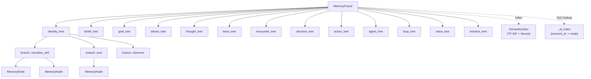

# Memory Forest

[<- Back to Index](index.md)

The Memory Forest is Elarion's long-term memory system — a hierarchical structure of trees, branches, and nodes that supports semantic search, thread-safe concurrent access, and incremental persistence.

Implemented in [`core/Memory.py`](../core/Memory.py).

In the **[minded architecture](minded-architecture-metaphor.md)** metaphor, the forest is **Memory** proper: the durable substrate the **Brain CPU** (LLM) grounds on, and which **Law** (the cycle) updates after each **Atomos**.

---

## Architecture



---

## Hierarchy

### Forest
The root container. One per Elarion instance. Holds all trees, the semantic index, the ID index, and a reentrant lock for thread safety.

### Trees (13 default)
Each tree represents a cognitive domain:

| Tree | Purpose |
|------|---------|
| `identity_tree` | Who Elarion is — soul anchors, role transitions, narrative self |
| `belief_tree` | Held beliefs, updated through experience and reconciliation |
| `goal_tree` | Active and historical goals with priorities |
| `dream_tree` | Dream motifs, consolidated patterns, imagination traces |
| `thought_tree` | Per-cycle experience records |
| `learn_tree` | Learned facts, rules, and patterns |
| `encounter_tree` | Interaction records with entities |
| `decision_tree` | Decisions made and their contexts |
| `action_tree` | Actions taken and their outcomes |
| `agent_tree` | Multi-agent state and consensus records |
| `loop_tree` | Diagnostic loop logs |
| `value_tree` | Value judgments and ethical weights (X7) |
| `emotion_tree` | Emotion state history across agents (X7) |

### Branches
Within each tree, branches partition nodes by perspective or agent. For example, `identity_tree` might have branches `narrative_self`, `soul`, and `observer`. With X7 multi-agent reconciliation, each tree can have a `common` branch plus `agent:<id>` branches.

### Nodes (`MemoryNode`)
The atomic unit of memory:

| Field | Type | Description |
|-------|------|-------------|
| `moment_id` | `str` (UUID) | Unique identifier |
| `timestamp` | `float` | Creation time (epoch) |
| `content` | `str` | The actual memory content |
| `emotion` | `str` | Dominant emotion at time of encoding |
| `confidence` | `float` | 0.0-1.0, decays over time or through pruning |
| `tags` | `List[str]` | Semantic labels for retrieval |
| `tree` | `str` | Parent tree name |
| `branch` | `str` | Parent branch name |

---

## Semantic Index

The `SemanticIndex` enables content-based retrieval without scanning every node.

### Dual Scoring
1. **TF-IDF** — term frequency-inverse document frequency matrix built from all node contents. Rebuilt lazily when dirty.
2. **Neural embeddings** — dense vectors from `NeuralEncoder` (sentence-transformers). Blended with TF-IDF using a learned weight.

### Tombstone Deletion
When nodes are removed (e.g., by `DreamConsolidator` pruning), they're marked as tombstones in the index rather than triggering an immediate rebuild. The next query triggers compaction — tombstoned rows are filtered out, and the matrix is rebuilt clean.

### Query Flow
```
query_text -> tokenize -> TF-IDF vector -> cosine similarity
                       -> neural embed  -> cosine similarity
                       -> blend(tfidf_score, neural_score, learned_weight)
                       -> top-K candidates
```

---

## Recall (Retrieval)

`MemoryForest.recall()` uses a two-phase index-driven approach:

**Phase 1 — Candidate Collection:**
- If `query_text` is provided: get top candidates from `SemanticIndex.query()`
- If `query_tags` are provided: scan recent branch tails for tag overlap
- If neither: fall back to recency (most recent nodes across branches)

**Phase 2 — Scoring:**
Only the candidate pool (not the entire forest) is scored:
- Semantic similarity (from index)
- Tag overlap bonus
- Recency decay
- Confidence weight

This changes recall from O(N_forest) to O(N_index + K log K) where K is the candidate pool size.

---

## Thread Safety

`MemoryForest` uses `threading.RLock` (reentrant lock) to protect:
- `add_node()` — adding nodes to trees, ID index, and semantic index
- `remove_node()` — atomic removal from tree, index, and semantic index
- `recall()` — reading nodes and querying the index
- `count_nodes()` — reading the cached count
- `to_dict()` — serialization
- `get_nodes_by_moment()` — ID-based lookup

The lock is reentrant because some operations (e.g., consolidation) call `add_node` from within a context that already holds the lock.

---

## Incremental Persistence

Instead of serializing the entire forest as one monolithic JSON file, the system tracks which trees have been modified:

1. `add_node()` and `remove_node()` mark trees in `_dirty_trees: Set[str]`
2. `Persistence.save()` only writes dirty trees to `data/cognitive/memory_trees/{tree_name}.json`
3. After saving, `mark_trees_clean()` clears the dirty set
4. `Persistence.load()` reads individual tree files (or falls back to legacy `memory_forest.json`)

This reduces save time from O(total_nodes) to O(dirty_nodes).

---

## Key Operations

### Adding a Memory
```python
node = MemoryNode(
    content="The user asked about weather",
    emotion="curious",
    confidence=0.8,
    tags=["conversation", "weather", "question"],
)
forest.add_node("encounter_tree", "user_alice", node)
```

### Recalling Memories
```python
results = forest.recall(
    query_text="What do I know about weather?",
    query_tags=["weather"],
    limit=5,
    min_confidence=0.3,
)
```

### Removing a Memory
```python
forest.remove_node(node.moment_id)  # Atomic: removes from tree + index
```

---

## Related Docs

- [Minded architecture](minded-architecture-metaphor.md) — Memory pillar; Atomos
- [X7 Features](x7-features.md) — Multi-agent branches, reconciliation, MemoryCore facade
- [Soul System](soul-system.md) — How soul memories are injected and protected
- [The Cognitive Cycle](cognitive-cycle.md) — Where memory is read and written each cycle
