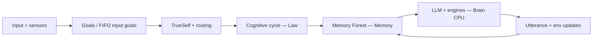

# Minded architecture: Atomos, the four pillars, and simulated sentience

[<- Back to Index](index.md)

This document is the **single canonical statement** of how HaromaX6 frames **coherent mind-like behavior**: not a claim of philosophical consciousness, but an engineering story that ties the major subsystems together. All other docs in `docs/` link back here for consistency.

---

## What we mean by “sentience” here

In this codebase, **sentience** means **stable, embodied, goal-directed cognition**: a loop that perceives, recalls, feels, plans, speaks, evaluates, and **rewrites memory** so the next cycle is not independent of the last. That is **architectural** or **functional** sentience — behavior that *looks* integrated from the outside. It does **not** prove inner experience, qualia, or general intelligence.

---

## Atomos (ἄτομος): the indivisible unit of a moment

Historically, *atomos* meant “uncuttable.” In Elarion, the closest analogue is **one atomic episode of processing** that binds input, state, and outcome:

- **Primary atom:** one **cognitive cycle** (`PersonaAgent._process_message` / `run_cycle` stages) for a single routed message.
- **Secondary atoms:** one **Message** delivered on the `input` channel to TrueSelf; one **input-derived goal** registered in the FIFO queue when that feature is enabled (`GoalEngine.register_input_goal`).

Larger “thoughts” are **molecules**: sequences of atoms (multi-turn dialogue, delegation, background training) held together by shared memory, goals, and identity.

---

## The four pillars

| Pillar | Subsystem | Role |
|--------|-----------|------|
| **Brain CPU** | LLM stack (`LLMContextReasoner`, `LLMBackend`, optional LLM-centric persona mode) | **Integrative processor:** compresses context (recall + soul + environment), proposes language and structured environment updates. Other engines act as **coprocessors** (emotion, reasoning templates, backbone, etc.). |
| **Memory** | `MemoryForest`, semantic index, working memory, persistence | **Experience store:** durable trees, fast recall, post-turn updates. The forest is not “a database bolt-on”; it is where meaning accumulates across Atomos. |
| **Law** | Cognitive cycle order, `ProcessGate`, law/value/myth stages, soul binding, symbolic queue (X7) | **Procedural constitution:** what steps run, in what order, what can be skipped, and what identity constraints cannot be violated. “Law” is **process + ethics-as-config**, not a separate legal engine. |
| **Fuel** | `GoalEngine`, FIFO input goals, drives, organizational goal board / CEO path | **Directive energy:** what the system is trying to do *now* and *next*. Without goals and drives, the loop still runs; with them, behavior becomes **purposeful** rather than purely reactive. |

Together: **Fuel** sets direction, **Law** constrains how direction is pursued, **Memory** grounds decisions in history, **Brain CPU** integrates signals into a response and optional structured self-updates.

---

## End-to-end flow (conceptual)

---

## How this relates to the soul

The **soul** (essence, principles, construction) is **not** the Brain CPU. It is the **non-negotiable identity substrate** loaded before persistence and re-asserted after restore. In the metaphor: soul is **charter** and **constitution**; law is **procedure**; memory is **biography**; goals are **current mission**; LLM is **executive synthesis**.

See [Soul System](soul-system.md).

---

## Related documentation

| Topic | Doc |
|-------|-----|
| Full pipeline | [Cognitive Cycle](cognitive-cycle.md) |
| Memory trees & recall | [Memory Forest](memory-forest.md) |
| Principles & invariants | [Design Philosophy](design-philosophy.md) |
| Code topology | [Architecture Overview](architecture.md) |
| Gaps & risks | [Architecture audit](architecture-audit.md) |

---

## For implementers

When adding a feature, ask:

1. **Fuel:** Does it create, complete, or reprioritize a goal or drive?
2. **Law:** Does it belong in a specific phase of the cycle, and can `ProcessGate` skip it?
3. **Memory:** Which tree(s) own the new facts, and is persistence/indexing handled?
4. **Brain CPU:** Does the LLM need new grounding (seed context), or is a small engine enough?

If all four answers are clear, the change is likely aligned with the minded architecture.

---

## Implementation alignment (code)

- **Fuel:** Every `GoalManager()` and `ReflectiveConsciousnessEngine` uses `get_shared_goal_engine()` so InputAgent, personas, TrueSelf, `ElarionController`, Dream/reconciler paths, and organizational goals see **one** `GoalEngine` and **one** FIFO `input_goal_queue` per process.
- **Atomos:** `input_goal_id` on `Message.content` is completed via `_complete_input_goal_from_message` on normal cycle end, **early-exit** shutdown paths inside `_process_message`, and **finally** blocks on TrueSelf when it runs the cycle locally (not when **delegating** to a persona — the specialist completes that goal).
- **Memory / Brain CPU / Law:** Unchanged contract — see [Cognitive Cycle](cognitive-cycle.md), [Memory Forest](memory-forest.md), and LLM stack in `engine/`.
