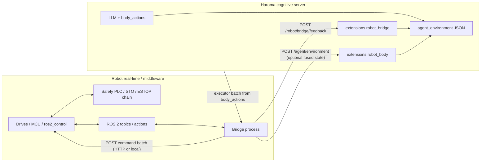

# Robot integration: cognitive server vs real-time control

[<- Back to Index](index.md)

**Step-by-step hookup:** [Robot integration (step-by-step)](robot-integration.md) — network, `/agent/environment`, command batches, `/robot/bridge/feedback`, ROS 2, reference demo.

HaromaX6 is a **long-running cognitive server** (Flask, multi-agent threads, LLM). It is **not** a hard real-time motor stack. Physical robots should treat Haroma as a **supervisor** that issues **high-level intents** and ingests **downsampled state**—while **torque loops, watchdogs, and safety-rated stops** live on **separate RT-capable hardware/software** (MCU, ROS 2 control, vendor motion, safety PLC).

This page maps **who owns what**, **recommended rates**, and **where JSON in this repo** connects to your on-robot bridge.

---

## Responsibility split

| Concern | Cognitive stack (Haroma) | Robot / RT stack (your deployment) |
|--------|---------------------------|-------------------------------------|
| Servo / torque @ kHz | No | Yes (MCU, drive, ROS2 `ros2_control`) |
| Deterministic cycle time | No (GC, LLM, threads) | Yes (configurable RT or soft RT) |
| ESTOP / STO / brakes | May **reflect** state in prompts | **Must** enforce independently of HTTP/LLM |
| High-level goals, language, scene | Yes | Optional fusion only |
| `body_actions` → discrete commands | Yes (LLM output → batch) | Bridge maps to actions/topics |
| Closed-loop joint tracking | No | Yes, locally |

---

## Data flow (target architecture)

**Rule:** The bridge **never** waits on the LLM per millisecond. It applies commands or rejects them using **local policy** (limits, mode, ESTOP).

---

## What maps to `agent_environment` (cognitive side)

These fields are **for reasoning and context**, not for substituting motor feedback at control rate.

| JSON area | Module / purpose | Typical update rate to Haroma |
|-----------|------------------|-------------------------------|
| `extensions.robot_body` | Layered embodiment (`mind/robot_body_state.py`) | **5–50 Hz** fused snapshot (position, mode, safety flags) |
| `extensions.robot_bridge` | Command lifecycle (`merge_robot_bridge_history`, feedback POST) | On **batch** or **event** (accepted/completed/failed) |
| Rest of `agent_environment` | Domain entities, metrics, alerts | As needed |

**Do not** push raw kHz joint streams through Flask as the sole feedback for torque—**close the loop on the robot**; send Haroma a **summary**.

---

## Command path (cognition → executor)

1. Packed LLM output includes **`body_actions`** (`engine/LLMContextReasoner.py`).
2. Your integrator calls **`build_executor_command_batch`** (`mind/robot_execution_contract.py`) to get a normalized batch (`bridge_schema_version`, `correlation_id`, `commands[]`).
3. A **bridge process** translates `commands[]` to ROS 2 actions, topics, or vendor APIs.
4. The robot reports results back via **`POST /robot/bridge/feedback`** (see `mind/elarion_server_v2.py`), merged into `extensions.robot_bridge`.

Traceability: keep **`command_id`** and **`correlation_id`** end-to-end.

---

## Feedback path (executor → cognition)

- **Normalize** payloads with **`normalize_feedback_payload`** (`status`, `command_id`, optional `t`).
- History is **merged and capped** (`merge_robot_bridge_history`, `MAX_ROBOT_BRIDGE_RESULTS`).
- Operators can inspect **`GET /status` → `agent_environment.robot_bridge`** and **`robot_bridge_metrics`** (counters for feedback POSTs).

---

## Safety layering (non-negotiable pattern)

1. **Hardware:** independent ESTOP, STO, contactors—must work if Python/Flask die.
2. **Controller / firmware:** joint limits, velocity caps, collision monitoring in **RT** or vendor safety.
3. **Middleware policy:** reject or clamp commands from upstream when mode is wrong (ESTOP, teach, protective stop).
4. **Haroma:** prompts and schemas may include **`safety`**, **`risk_posture`**, ESTOP hints—treat as **advisory** input to the LLM, **not** proof of functional safety.

---

## Integration checklist

- [ ] Torque / position loops run **only** on the robot stack; Haroma never blocks inner loops.
- [ ] Bridge applies **timeouts** and **rejects** invalid commands without waiting for cognition.
- [ ] **ESTOP** is visible in fused `robot_body` / bridge state for the LLM, but **physical** ESTOP does not depend on Haroma.
- [ ] Command batches are **idempotent** where possible; use **`command_id`** to dedupe feedback.
- [ ] Environment updates to Haroma are **rate-limited** and **bounded** (see env max bytes in `mind/environment_context.py`).

---

## Code pointers

| Piece | Location |
|-------|----------|
| Command batch + feedback schema | `mind/robot_execution_contract.py` |
| Merge feedback into environment | `integrations/robot_http_bridge.py` |
| Layered body state for prompts | `mind/robot_body_state.py` |
| Packed LLM sections (env + body + bridge) | `mind/packed_llm_context.py` |
| HTTP feedback route | `POST /robot/bridge/feedback` in `mind/elarion_server_v2.py` |
| Reference bridge (HTTP client, stub executor, demo CLI) | `bridge/README.md`, `bridge/sample_http_bridge.py` |

---

## Related docs

- [Robot integration (step-by-step)](robot-integration.md) — practical integration sequence
- [Architecture Overview](architecture.md) — server topology
- [API Reference](api-reference.md) — REST surface
- [Sensor Integration](sensors.md) — adapters and push protocols
- [Bridge samples (README)](../bridge/README.md) — stub executor + `sample_http_bridge.py`
- [Minded architecture](minded-architecture-metaphor.md) — Atomos and sensory gates
