# Sensor Integration

[<- Back to Index](index.md)

Elarion can perceive the physical world through hardware sensors. The sensor layer supports both **pull** (polling) and **push** (HTTP POST) models, with adapters for 10 sensor types.

Implemented in [`sensors/adapters.py`](../sensors/adapters.py). A stable **sense-domain** label for any `channel` string (including aliases like `cam`, `mic`, `imu`) is defined in [`sensors/domains.py`](../sensors/domains.py) and returned on `POST /sensor` as `sense_domain`.

Sensors feed the **embodied** side of the minded model: perception enters **Law** (the cycle), is fused with text when configured, and lands in **Memory** after consolidation — the **Brain CPU** reasons over a snapshot that includes body-state. See **[Minded architecture](minded-architecture-metaphor.md)**.

---

## Architecture

```mermaid
flowchart LR
    subgraph Hardware["Physical Sensors"]
        CAM["Camera"]
        MIC["Microphone"]
        TOUCH["Pressure"]
        LIDAR["LiDAR"]
        IR["Infrared"]
        IMU["IMU/Gyro"]
        GPS["GPS"]
    end

    subgraph Adapters["SensorAdapter Classes"]
        VA["VisionAdapter"]
        AA["AudioAdapter"]
        TA["TouchAdapter"]
        LA["LidarAdapter"]
        IRA["InfraredAdapter"]
        IA["ImuAdapter"]
        GA["GpsAdapter"]
    end

    subgraph System["HaromaX6"]
        SP["SensorPoller"]
        BUF["SensorBuffer"]
        RC["run_cycle()"]
    end

    Hardware --> Adapters
    Adapters -->|"poll()"| SP
    SP -->|"push_sensor()"| BUF
    BUF -->|"drain()"| RC

    EXT["External API"] -->|"POST /sensor"| BUF
```



---

## Available Adapters

| Adapter | Sensor Type | Libraries | Platform |
|---------|-------------|-----------|----------|
| `VisionAdapter` | Camera / webcam | `opencv-python` | All |
| `AudioAdapter` | Microphone | `pyaudio` / `sounddevice` | All |
| `TouchAdapter` | Pressure / touch | `smbus2` (I2C) | Raspberry Pi |
| `SmellAdapter` | Chemical / gas | `smbus2` (I2C) | Raspberry Pi |
| `TasteAdapter` | Chemical composition | `smbus2` (I2C) | Raspberry Pi |
| `LidarAdapter` | LiDAR distance | `rplidar` / serial | USB LiDAR |
| `InfraredAdapter` | IR thermal | `smbus2` (I2C) | MLX90614, FLIR |
| `ImuAdapter` | Accelerometer / gyro | `smbus2` (I2C) | MPU6050 |
| `GpsAdapter` | GPS coordinates | `serial` / `gpsd` | USB GPS |

Each adapter inherits from `SensorAdapter` and implements:
- `poll() -> dict` — read current sensor value
- `is_available() -> bool` — check if hardware is connected

---

## Sense domains (taxonomy)

Classical **five senses** map to: **vision**, **audition** (channel `audio`), **touch**, **olfaction** (`smell`), **gustation** (`taste`). **Beyond those**, Haroma uses separate domains for **thermal/IR** (`infrared`), **spatial range** (LiDAR / depth geometry), **spatial global** (GNSS), and **proprioception** (IMU — accelerometer/gyro; vestibular/balance cues are grouped here). **Embodiment context** applies to `channel` values `agent_environment` / `environment` when posting a structured world snapshot.

| `SenseDomain` value | Typical channels / aliases |
|---------------------|----------------------------|
| `vision` | `vision`, `cam`, `camera`, `webcam` |
| `audition` | `audio`, `mic`, `microphone`, `sound` |
| `touch` | `touch`, `tactile`, `pressure` |
| `olfaction` | `smell`, `gas`, `olfaction` |
| `gustation` | `taste`, `gustation` |
| `thermal_radiance` | `infrared`, `ir`, `thermal` |
| `spatial_range` | `lidar`, `depth`, `tof`, `pointcloud` |
| `spatial_global` | `gps`, `gnss`, `location` |
| `proprioception` | `proprioception`, `imu`, `gyro`, `vestibular`, `balance` |
| `embodiment_context` | `agent_environment`, `environment` |

Use `from sensors.domains import resolve_channel_to_domain` (or import from `sensors`) to resolve a string to `SenseDomain`. Successful `POST /sensor` responses include `sense_domain` alongside `channel`.

---

## Polling Model (Pull)

The `SensorPoller` runs in a background thread and periodically calls `poll()` on each registered adapter:

```python
from sensors.adapters import SensorPoller, VisionAdapter, AudioAdapter

poller = SensorPoller(interval=1.0)
poller.register(VisionAdapter())
poller.register(AudioAdapter())
poller.start(sensor_buffer)
```

---

## Push Model (HTTP)

External systems push data via the REST API — no code changes needed:

```bash
curl -X POST http://localhost:8193/sensor \
  -H "Content-Type: application/json" \
  -d '{"channel": "temperature", "data": {"celsius": 22.5}}'

curl -X POST http://localhost:8193/sensor \
  -H "Content-Type: application/json" \
  -d '{"channel": "gps", "data": {"lat": 37.77, "lon": -122.42}}'
```

Ideal for remote sensors, IoT devices, testing, and simulation.

---

## Data Flow Through Cognition

1. **Ingress** — HTTP `POST /sensor` or **`SensorPoller`** pushes into **`InputAgent`** queues (thread-safe deques inside [`agents/input_agent.py`](../agents/input_agent.py)).
2. **Drain** — **`InputAgent._tick`** drains queued sensor (and text) items and forwards them toward **TrueSelf** on the **`MessageBus`** (see [Architecture Overview](architecture.md)).
3. **Perceive** — `PerceptionManager` interprets raw data through modality-specific perceptors
4. **Tags** — raw data becomes symbolic tags and content for the pipeline
5. **Memory** — significant events stored as `MemoryNode`s in `encounter_tree`
6. **Learning** — `EnvironmentGrounder` learns causal rules from patterns

---

## Raspberry Pi Setup

The Linux setup script detects Raspberry Pi and installs I2C/GPIO libraries:

```bash
pip install smbus2 RPi.GPIO adafruit-circuitpython-bmp280
sudo raspi-config  # Interface Options -> I2C -> Enable
```

Common I2C addresses:

| Sensor | Address | Adapter |
|--------|---------|---------|
| BMP280 (temp/pressure) | 0x76 / 0x77 | `TouchAdapter` |
| MLX90614 (IR thermal) | 0x5A | `InfraredAdapter` |
| MPU6050 (IMU) | 0x68 | `ImuAdapter` |
| MQ-series (gas) | 0x48 (ADC) | `SmellAdapter` |

---

## Adding a Custom Sensor

```python
from sensors.adapters import SensorAdapter

class MyCustomSensor(SensorAdapter):
    def __init__(self):
        super().__init__(channel="custom_sensor")

    def is_available(self) -> bool:
        return True

    def poll(self) -> dict:
        return {"value": 42, "unit": "custom_units"}
```

Register with the poller, or just use `POST /sensor` with no code changes.

---

## Related Docs

- [Minded architecture](minded-architecture-metaphor.md) — Embodied perception
- [Getting Started](getting-started.md) — Setup scripts that install sensor libraries
- [API Reference](api-reference.md) — `POST /sensor` endpoint
- [Architecture Overview](architecture.md) — Where sensors fit in the topology
