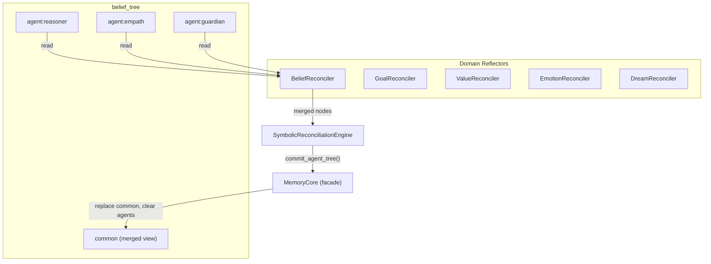
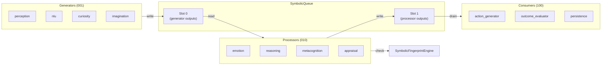

# X7 Features

[<- Back to Index](index.md)

Three architectural features from the HaromaX7 design spec have been integrated into HaromaX6: multi-agent reconciliation, queue integrity with drift control, and a 15-organ module registry. These are additive — all existing APIs remain backward-compatible.

Reconciliation and queue integrity extend **Law** (how multiple voices agree and how symbolic state stays coherent); organs are a taxonomy for monitoring the **whole minded stack**. See **[Minded architecture](minded-architecture-metaphor.md)**.

---

## 1. Multi-Agent Reconciliation

Each symbolic tree can have multiple agent perspectives. Reflectors merge these into a unified `common` view.

### Architecture



### Components

**`MemoryCore`** ([`core/MemoryCore.py`](../core/MemoryCore.py)) — Facade over `MemoryForest` that adds agent-branch semantics:
- `get_context(tree, agent_id)` — merged `common` + agent branch nodes
- `set_context(tree, content, agent_id)` — write to `common` or `agent:<id>` branch
- `commit_agent_tree(tree, nodes)` — atomically replace `common` and clear agent branches
- `list_agent_branches(tree)` — list all `agent:*` branches
- `get_identity()` — read-only aggregate of all identity branches

**Domain Reflectors** ([`core/Reconciliation.py`](../core/Reconciliation.py)) — Five reconcilers, each handling one tree:

| Reflector | Tree | Strategy |
|-----------|------|----------|
| `BeliefReconciler` | `belief_tree` | Majority vote on conflicting keys, confidence averaging |
| `GoalReconciler` | `goal_tree` | Union of goals with priority averaging |
| `ValueReconciler` | `value_tree` | Weighted merge; soul-sourced values kept at confidence 1.0 |
| `EmotionReconciler` | `emotion_tree` | Intensity averaging across agents |
| `DreamReconciler` | `dream_tree` | Motif merging with source counting |

**`SymbolicReconciliationEngine`** — Orchestrates all reflectors:
1. Calls each reflector's `reconcile_agents()`
2. Calls `commit_agent_tree()` for each domain
3. Returns per-domain summary of what changed

### Integration
Reconciliation runs as **step 8.5** in the cognitive cycle, between dream consolidation and identity update. Gated by `_gate_decisions` and triggered every 10 cycles when agent branches exist.

---

## 2. Queue Integrity + Drift Control

The X7 Symbolic Cell Architecture classifies modules by role and uses hashed queues to detect feedback loops and stagnation.

### Architecture



### Components

**`SymbolicQueue`** ([`core/SymbolicQueue.py`](../core/SymbolicQueue.py)) — Two-slot queue with hash-based drift control:
- **Slot 0**: Generator outputs (perception, NLU, etc.)
- **Slot 1**: Processor outputs (emotion, reasoning, metacognition, etc.)
- Each entry is keyed by `namespace.key` and carries an MD5 hash
- Writing the same hash as the previous cycle increments `stale_cycles`
- Entries unchanged for >= threshold cycles are suppressed from reads

Key methods:
- `write(slot, namespace, key, value)` — returns `False` if value hash is unchanged (stale)
- `read(slot)` — returns only non-stale entries
- `drain(slot)` — returns all pending entries and clears the slot
- `flush_stale()` — removes entries stale for >= N cycles

**`SymbolicFingerprintEngine`** — Tracks per-module output hashes across cycles:
- `is_novel(module, output)` — returns `True` if output changed since last cycle
- `is_stagnant(module)` — returns `True` if unchanged for >= threshold cycles
- `stagnation_report()` — lists all stagnant modules

**`CellRoles`** ([`core/CellRoles.py`](../core/CellRoles.py)) — Soft 3-bit role annotations for 31 modules:

| Role | Code | Modules |
|------|------|---------|
| Generator | `001` | perception, encoder, nlu, curiosity, imagination, dream, discourse |
| Processor | `010` | appraisal, reasoning, attention, self_model, backbone, metacognition, counterfactual, goal_synthesizer, process_gate, temporal, grounder, mental_simulator, arch_searcher, workspace, modulation |
| Consumer | `100` | action_generator, outcome_evaluator, dream_consolidator, persistence, narrative, conversation |
| Generator+Processor | `011` | emotion |
| Generator+Consumer | `101` | knowledge |
| Processor+Consumer | `110` | composer |

### Integration
Queue hooks are wired at four points in the cognitive cycle:
1. **Step 1.9** — generators write perception + NLU to slot 0
2. **Step 13.9** — processors write emotion/reasoning/metacognition to slot 1; fingerprint engine checks for staleness
3. **Step 14** — consumers can read slot 1 for accounting
4. **Step 16.5** — end-of-cycle flush of stale entries; fingerprint the final action

The queue is a parallel accounting layer — existing direct module calls remain unchanged.

---

## 3. Fifteen-Organ Module Registry

All modules are grouped into 15 functional "organs" for discoverability, health monitoring, and future modular loading.

### Organ Catalog

```mermaid
graph LR
    subgraph Organs["15 Organs"]
        O1["1. Symbolic Core"]
        O2["2. Emotional Regulation"]
        O3["3. Belief & Ethics"]
        O4["4. Cognitive Management"]
        O5["5. Identity & Agents"]
        O6["6. Memory"]
        O7["7. Dream & Imagination"]
        O8["8. Goals & Motivation"]
        O9["9. Conflict Resolution"]
        O10["10. Tagging & Classification"]
        O11["11. Predictive & Temporal"]
        O12["12. Meta-Reflection"]
        O13["13. Stability & Integrity"]
        O14["14. Narrative & Dialogue"]
        O15["15. Bootstrapping"]
    end
```



| Organ | Name | Modules |
|-------|------|---------|
| 1 | Symbolic Core | knowledge, reasoning, encoder, symbolic_loop |
| 2 | Emotional Regulation | emotion, appraisal, modulation, affective_reasoning |
| 3 | Belief & Ethics | belief_cohesion, doctrine_cortex, knowledge_base, context_bridge |
| 4 | Cognitive Management | metacognition, curiosity, attention, process_gate, backbone, workspace, training_scheduler, arch_searcher |
| 5 | Identity & Agents | soul_binder, identity, interlocutor_model, mental_simulator |
| 6 | Memory | memory, memory_core, working_memory, persistence, loop_logger, memory_summarizer |
| 7 | Dream & Imagination | dream_consolidator, dream, imagination |
| 8 | Goals & Motivation | goal, drives, goal_synthesizer |
| 9 | Conflict Resolution | fusion, counterfactual, reconciliation |
| 10 | Tagging & Classification | perception, discourse, nlu |
| 11 | Predictive & Temporal | temporal, self_model, grounder |
| 12 | Meta-Reflection | episode_context, reflector |
| 13 | Stability & Integrity | symbolic_queue, fingerprint_engine |
| 14 | Narrative & Dialogue | narrative, conversation, composer, action_generator |
| 15 | Bootstrapping | controller, server, fabric, sensor |

### Components

**`OrganRegistry`** ([`core/OrganRegistry.py`](../core/OrganRegistry.py)):
- `register_module(name, ref)` — register a live module instance
- `record_error(module)` — track errors per module
- `touch(module)` — mark a module as active this cycle
- `organ_status()` — per-organ health: module count, registered count, errors, last active, healthy flag
- `summary()` — compact overview for API responses

### Integration
- Initialized in `ElarionController.__init__()` via `_register_organs()` which maps ~40 live module instances
- Exposed in the `/status` API endpoint alongside queue and reconciliation stats
- Each organ reports: module count, registered count, error count, last active timestamp, healthy flag

### `/status` Response (Organ Section)
```json
{
  "organs": {
    "organ_count": 15,
    "healthy_organs": 14,
    "total_registered_modules": 40,
    "total_errors": 0,
    "organs": {
      "1": {"name": "Symbolic Core", "healthy": true, "registered": 3, "module_count": 4},
      "2": {"name": "Emotional Regulation", "healthy": true, "registered": 3, "module_count": 4},
      ...
    }
  }
}
```

---

## Related Docs

- [Minded architecture](minded-architecture-metaphor.md) — Law extensions via reconciliation / queue
- [Architecture Overview](architecture.md) — System topology with X7 layers
- [Memory Forest](memory-forest.md) — The underlying storage for reconciliation
- [The Cognitive Cycle](cognitive-cycle.md) — Where X7 hooks integrate (steps 1.9, 8.5, 13.9, 16.5)
- [API Reference](api-reference.md) — `/status` endpoint details
